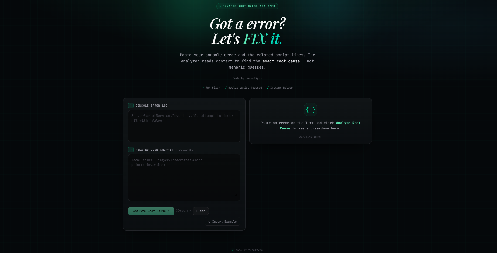

<div align="center">
  <br>
  <h1>Error Parser & Solution Guide</h1>
  <p><b>Dynamic root cause analyzer for Roblox Scripts.</b></p>
  <p><i>Stop guessing. Start fixing.</i></p>
  
  <br>
  
 
  
  <br>
  
  <a href="https://error-parser-solution-guide.vercel.app/"><b>Live Demo</b></a> • 
  <a href="#features">Features</a> • 
  <a href="#installation">Installation</a>
</div>

---

### 🚀 The Problem
Debugging takes time. Context switching between console logs and script lines drains productivity. **Error Parser** reads your error trace and context to pinpoint the *exact* root cause, not generic guesses.

### ✨ Features
*   **Intelligent Analysis**: Context-aware root cause detection.
*   **Fast**: Optimized for the developer workflow.
*   **98% Fixer Rate**: High accuracy in diagnosing common runtime exceptions.

### 🛠 Tech Stack
Built with modern tools for performance and scalability:


---

### 💻 Installation
Getting started with the local development environment:

```bash
# Clone the repository
git clone [https://github.com/YusufVyce/error-parser-solution-guide.git](https://github.com/YusufVyce/error-parser-solution-guide.git)

# Install dependencies
bun install

# Start development server
bun run dev
