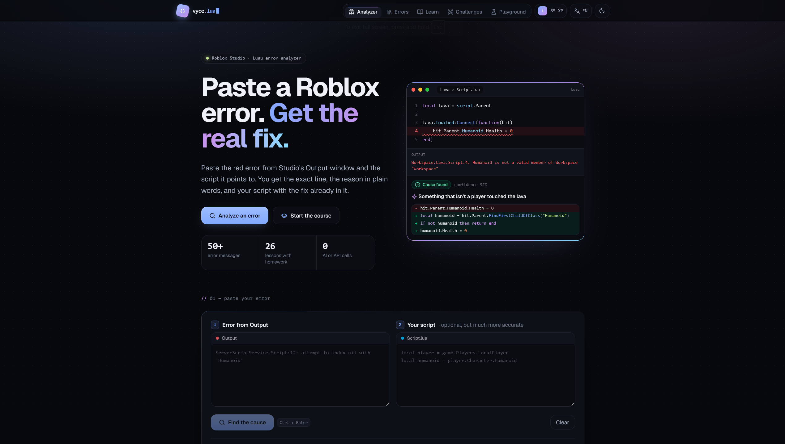

<div align="center">

# Vyce LuaUtility

### AST-Powered Runtime Diagnostics for Roblox Studio (Luau)

Offline runtime error analysis with semantic understanding, root cause detection, and actionable debugging guidance.

**Built exclusively for Roblox Studio (Luau).**



<p>
  <a href="https://parser.vyce.studio"><strong>🌐 Website</strong></a> •
  <a href="#features"><strong>✨ Features</strong></a> •
  <a href="#architecture"><strong>🏗 Architecture</strong></a> •
  <a href="#example"><strong>📖 Example</strong></a> •
  <a href="#installation"><strong>💻 Installation</strong></a> •
  <a href="#roadmap"><strong>🛣 Roadmap</strong></a>
</p>

</div>

---

# About

Vyce LuaUtility is an open-source runtime diagnostics engine built specifically for **Roblox Studio (Luau)**.

Unlike traditional analyzers that rely primarily on regex matching, Vyce LuaUtility parses Luau source code into a lightweight Abstract Syntax Tree (AST), extracts semantic information, and combines it with runtime error data to determine the most likely root cause.

Everything runs locally.

No AI.

No API keys.

No cloud services.

No internet connection required.

Its purpose is not only to tell you **where** an error occurred—but to explain **why** it happened and how to fix it.

---

# Precise Diagnosis & Learn Page

- **Exact message recognition** — 50+ real Roblox/Luau error messages (index/call/math on nil, "is not a valid member", infinite yield, script timeout, syntax errors, RemoteEvents, DataStores, HttpService, tweens, animations…) are parsed with their captured names.
- **Code tracing** — finds the failing line, the exact nil expression, and where it came from (`FindFirstChild` miss, `LocalPlayer` on the server, `player.Character` before spawn, `GetAsync` for new players, typos, functions used before their definition…).
- **Explainable confidence** — the score only increases for evidence the analyzer verified; the "Why?" button lists every step. Unrecognized messages are reported honestly instead of guessed.
- **Only real documentation links** — links come from an allowlist of official create.roblox.com pages (`src/lib/analyzer/precise/docs.ts`); nothing is generated from API names and no forum links are shown.
- **Beginner explanations** — every diagnosis adds an everyday analogy ("In plain words"), a step-by-step walk through the failing expression (`hit` ✓ → `.Parent` ✓ → `.Humanoid` ✗), a mini glossary of the words used, and **your whole script with the fix applied** (only shown when the patched script still parses).
- **Real syntax check** — pasted code is parsed by a real Luau parser, so missing `end`s, `=` instead of `==`, `!=` and similar mistakes are reported with Studio-style messages and the exact line.
- **Only real documentation links** — links come from an allowlist of official create.roblox.com pages (`src/lib/analyzer/precise/docs.ts`); nothing is generated from API names and no forum links are shown.

Engine: `src/lib/analyzer/precise/` · Ground-truth tests: `src/lib/analyzer/precise/diagnose.test.ts`

# Learn, Homework & Playground

- **Learn (`/learn`)** — a free course that teaches Roblox Studio scripting from zero: illustrations, copy-paste code, examples inspired by popular games, common mistakes (openable in the analyzer) and quizzes.
- **Homework after every lesson** — the learner writes real code in an editor. It runs in a simulated Roblox server in the browser and is graded by concrete checks ("Output shows 42", "the Lava kills a player", "leaderstats has Coins = 0"…). Failing checks say exactly what the checker saw, runtime errors are explained by the analyzer, and the code is re-run with different starting values so hard-coded answers don't pass. Hints and a solution (after a few tries) are available.
- **Progress** — passing the quiz and the homework unlocks the next lesson; XP and levels (Noob → Legend). Progress is stored only in the browser (localStorage).
- **Playground (`/playground`)** — a tiny Roblox server in the browser: write a Script and a LocalScript, press Run, then make players join/leave, touch parts, press keys or click GUI buttons and watch Output and Explorer update.
- **Error library (`/errors`)** — searchable list of ~60 common Roblox errors with the usual cause and a link to the full explanation.

### Offline Luau simulator

`src/lib/luau/` contains a small Luau interpreter written for this site — lexer, parser (with type annotations skipped), and a tree-walking evaluator with coroutines, `task` scheduling on a virtual clock and Roblox-exact error messages. `src/lib/luau/roblox/` simulates the parts of the engine beginners use: Instances and ~100 classes, properties with type checking, events (`Touched`, `PlayerAdded`, `Changed`…), players and characters, RemoteEvents/Functions with client/server rules, TweenService, DataStores (in memory), CollectionService, Debris, raycasts and ModuleScripts. Physics, rendering and networking lag are not simulated.

Homework exercises and graders: `src/lib/learn/homework/` (graded in a Web Worker).

---

# Features

- 🌳 Lightweight Luau AST parser
- 🧠 Semantic runtime analysis
- 🔍 Context-aware root cause detection
- 💡 Practical debugging suggestions
- 📚 Human-readable explanations
- ⚡ Fully offline execution
- 🛡 Roblox-specific diagnostics
- 📈 Confidence-based hypothesis ranking
- 🔒 No AI or external services
- 🧩 Extensible diagnostics pipeline

---

# Architecture

```
Console Error
        │
        ▼
Normalization
        │
        ▼
Error Classification
        │
        ▼
Lexer
        │
        ▼
Tokenizer
        │
        ▼
Parser
        │
        ▼
Luau AST
        │
        ▼
Semantic Analysis
        │
        ▼
Evidence Engine
        │
        ▼
Hypothesis Engine
        │
        ▼
Confidence Scoring
        │
        ▼
Explanation Generator
        │
        ▼
Fix Generator
```

The runtime analysis pipeline is fully deterministic and executes locally without external dependencies.

---

# Supported Analysis

Examples include:

- attempt to index nil
- attempt to call nil
- arithmetic on nil
- invalid argument
- infinite yield
- stack overflow
- table index is nil
- invalid service
- invalid class
- coroutine errors
- module loading issues

...and many more.

---

# Example

### Input

```text
attempt to index nil with 'Health'

Script: EnemyController.lua
Line: 42
```

### Output

```text
Root Cause

FindFirstChild() returned nil, therefore the "enemy" reference was never assigned.

Evidence

The analyzer detected an object lookup without a successful assignment before property access.

Suggestion

Verify the object exists before accessing enemy.Health.

Confidence

94%
```

---

# Why Vyce LuaUtility?

Most runtime analyzers stop after recognizing an error message.

Vyce LuaUtility goes further by understanding the surrounding Luau code structure through semantic analysis, allowing it to generate more accurate explanations and practical debugging guidance.

The project is designed around three principles:

- Deterministic diagnostics
- Roblox-first development
- 100% offline execution

---

# Tech Stack

- TypeScript
- React
- Vite
- TanStack Router
- Bun

---

# Installation

```bash
git clone https://github.com/YusufVyce/Vyce-Luau-ErrorAnalyzer.git

cd Vyce-LuaUtility

bun install

bun run dev
```

---

# Roadmap

## Completed

- ✅ Lightweight Luau parser
- ✅ AST generation
- ✅ Semantic analysis engine
- ✅ Evidence engine
- ✅ Hypothesis engine
- ✅ Confidence scoring
- ✅ Human-readable explanations
- ✅ Roblox-specific diagnostics
- ✅ Fully offline runtime analysis

## Planned

- More Luau syntax coverage
- Additional Roblox API semantics
- Expanded diagnostics database
- Roblox Studio plugin
- Performance optimizations
- Community-contributed diagnostics

---

# Contributing

Contributions are welcome.

You can help by:

- Reporting bugs
- Improving parser coverage
- Adding new diagnostics
- Improving semantic analysis
- Expanding Roblox API support
- Opening pull requests

---

# License

Licensed under the GNU General Public License v3.0.
